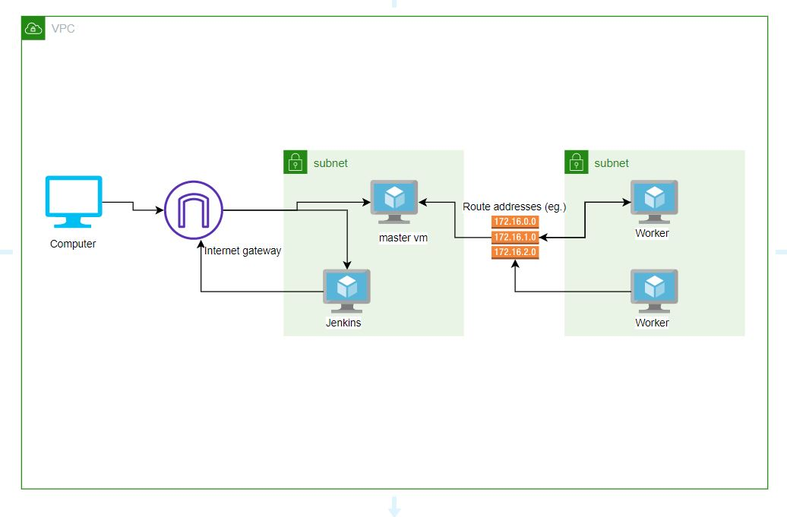
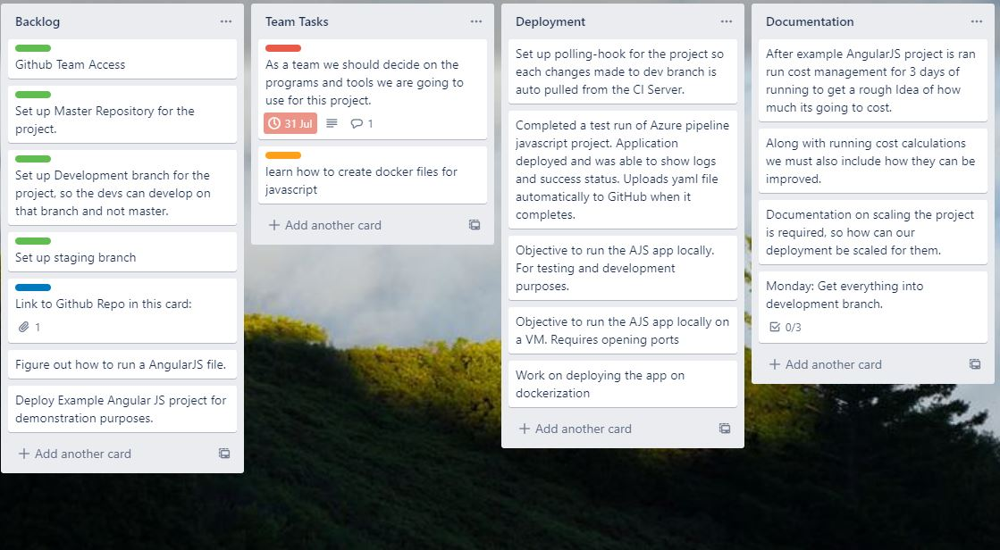
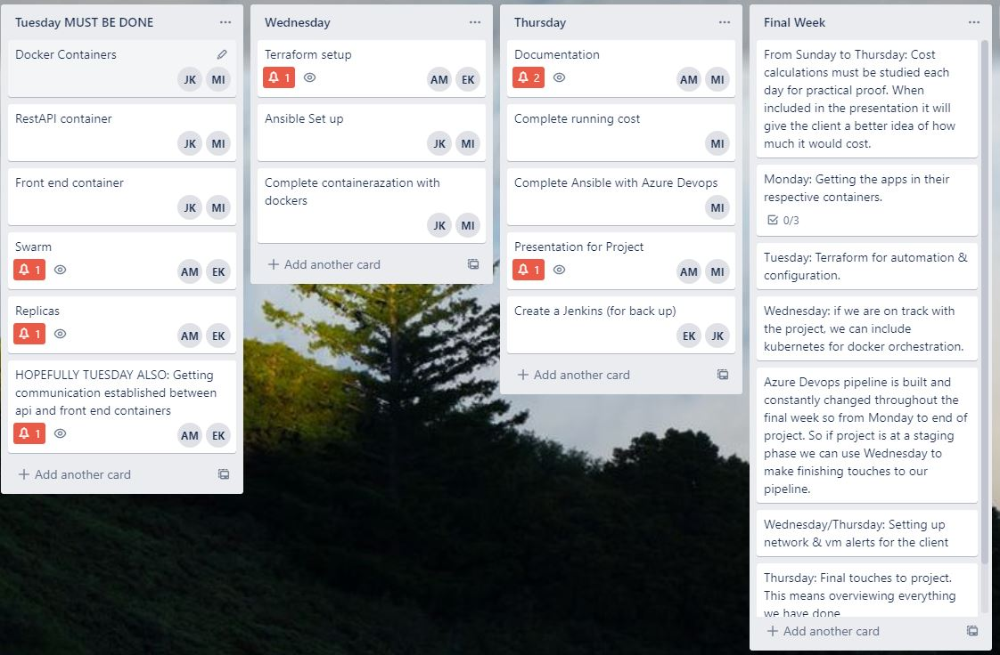
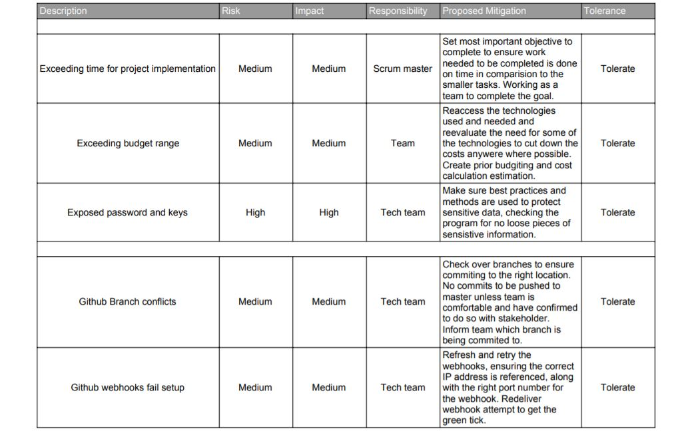
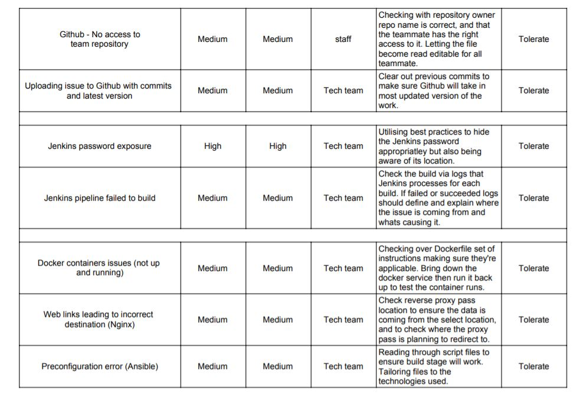
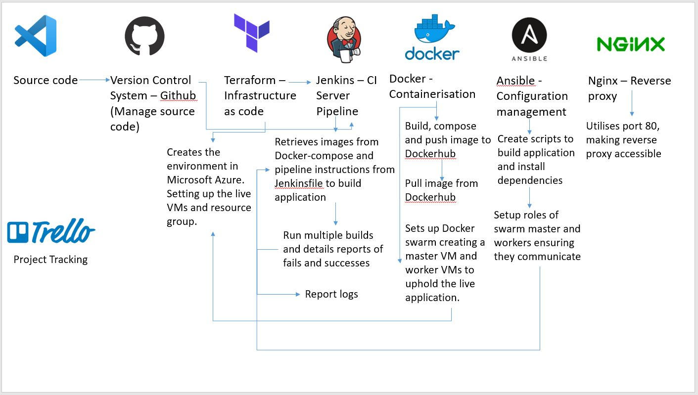
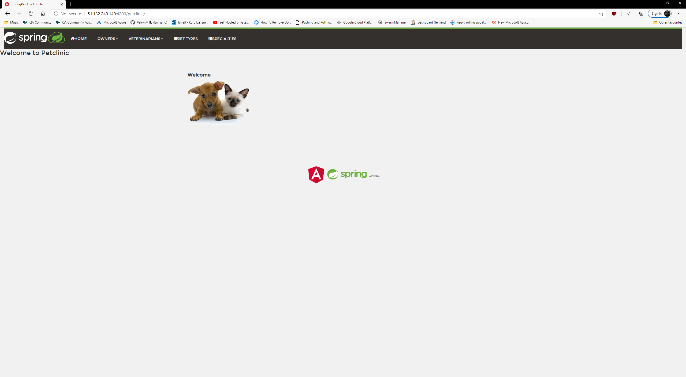

# DevOps-Final-Project

## Contents
### 1. [Brief](#Brief)
#### 1. [Objective](#Objective)
#### 2. [Method of Approach](#MOP)
### 2. [Architecture](#Architecture)
### 3. [Project Tracking](#PT)
### 4. [Risk Assessment](#Risk-Assessment)
### 5. [Implementation](#imp)
### 6. [Costs](#Costs)

## Brief
### Objectives
The goal of the final group project in summary was to plan, design and implement an AngularJS application’s development and deployment to a live environment, enabling the user to run the application via the web link. The idea was to utilise the technologies learnt within the course of the training and be able to showcase our team work on our chosen best practices and uses of the technologies at hand. The application environment must support the automation of build and deploy to a live environment, updating any changes made or additional progress directly to the chosen version control system. Costing for the project was to be included and calculated, and Microsoft Azure was our host platform.

### Method of Approach
We were openly allowed to make use of all the technologies we had learnt over the training period, as the external applications were created via Javascript and the application’s front-end and back-end must be able to communicate as the data is retrieved by requesting from the front-end. The group made use of:
IAAS – Terraform to preconfigure the live environment of the virtual machine and feature the relevant nodes’ build structures defining the swarm orchestration.
CI Server – The team had gone through a number of best approaches for the server options, the final chosen tool was Jenkins, functioning as the pipeline with webhooks linked to Git Hub, triggering builds.

## Architecture 
The tools for each component of the CI pipeline that the team had utilised:

-	CI Server and deployment server - Jenkins
-	Version Control System (VCS) – Git 
-	Project Tracking - Trello
-	Infrastructure of code – Terraform
-	Application container deployment – Docker Swarm
-	Containerisation and orchestration tool – Docker/Docker-compose
-	Reverse proxy web server – Nginx
-	Configuration management – Ansible

### Architect Diagram 

The architect diagram gives a breakdown of how the user interacts with the system, accessing the master virtual machine directly through the standard internet gateway. Microsoft Azure was used to host the private network virtual environment, connecting to Azure virtual machines for each role. The master VM hosting the main location of the application, producing the output to be displayed onto a HTML webpage. The master VM links within a Docker swarm cluster, connecting to the worker virtual machines via a generated token to join the network of machines together. These worker machines ensure the application has replicas, complying with the master VM’s requests and keeping the website active and live.

## Project Tracking

The project tracking was created using Trello board. The team broke down the objective at hand into tasks and stages within the first sprint of the project. The backlog holds the introductory stages needed for the project as well as the location for the repository that was being worked on. Team tasks was a section that outlined the initial most important tasks to complete in order to get a structure for the application. Deployment expands on the thought process of how to application is going to be deployed into a live environment, as the application was ran in AngularJS a number of new technologies such as Azure pipeline was to be researched. The documentation broke down some key features needed to be included within this README file.

The final project week had then been broken down into smaller stages for each corresponding day, partnering team members together to complete specific parts of the project together to get work done effectively and efficiently, keeping to a schedule to maintain time aspects. These tasks were requirements in order for the objective to be complete, utilising the key tools between team members to work on. 

## Risk Assessment
During the project many different potential risks arose during the production of the application, this including risks with the technologies that were being used and their functionality. The risks varied depending on how the application would be deployed as different technologies were brought in to aid with various factors. The risk assessment breaks down into describing the issue, the impact and risk level. It also includes who is responsible and how the issue could be mitigated.

## Implementation

### Terraform
Terraform is an open source application that the team decided to use for the project as it worked perfectly creating the detailed plan of setting up the correct virtual machines necessary and their resource group that features important variables like the location of the Azure VMs and resource group name so it can be accurately referenced. To avoid any chances of duplication of code, modules had been utilised to reference already created segments for reuse. The terraform set up the team’s Infrastructure via Docker swarm, creating all resource factors such as the IP addresses for each virtual machine and their respective public keys. This automated the creation of sharing the key between the master and worker virtual machines.

### Ansible
Ansible is a configuration management tool that the team used to aid the deployment of the application. This had set up the prerequisites and install all the dependencies needed for the virtual machines and environment to ensure the deployment of the application. As Terraform was used to create the machines, Ansible had the role of structuring the build stages of each technology applied. Using its automation language YAML, the necessary files were created to set up the roles of each virtual machines which included their unique IP addresses.  

### Jenkins Pipeline
The CI Server used was Jenkins, a self-contained open source automation server used to automate all tasks such as the build stages, delivering and deploying. Jenkins works by jobs which contain steps to run the necessary files to automate the program. Linking directly to the Version Control System used (Github) via webooks, Jenkins used its pipeline design to stage the deployment of the pet clinic application. 

## Deployment
The application was deployed via Jenkins autonomous build, producing the pet clinic page accessible on a HTML webpage via a direct IP address with its correct port number. To display the front end the port ran on 4200, the back end port ran on 9966. As showing in the following screenshot is the successful run of the home page of the application. 

## Costs
The aim was to keep cost under £15 pounds for this project, the team only spent close to £8, being well under the budget.
The cost for 3 Virtual Machines is £180, Standard_D2s_v3 -2 vcpus, 8 GIB memory per month.
The Estimated cost for the app to run is approximately £114 based on 3standard_DS1_v2 - 1 Vcpu, 3.5 GIB memory (£37.73/month). Over time we can estimate the traffic on the website and then set scales for our app to save more cost.

